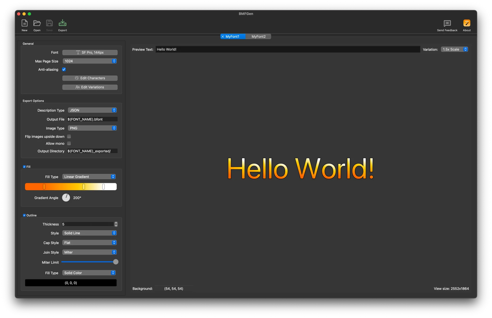

# BMFGen


BMFGen is an open source, easy-to-use bitmap font generator for Windows, macOS and Linux.

Simply choose a font, tweak it, and export it to a format of your choice.

[https://bmfgen.com](https://bmfgen.com)



## Features

- Fill glyphs with a solid color, linear gradient, radial gradient or an image.
- Add an outline to glyphs, with an optional fill.
- See your generated font as you design it and test it with an example text.
- Load fonts directly from your system, including TTF and OTF.
- BMFGen comes with predefined Unicode character sets for you to include in your fonts.
- Design your fonts and export them in multiple sizes at once, e.g. for low-DPI and high-DPI displays.
- All glyphs are packed efficiently in such a way that displaying them is as easy as possible, while respecting a
  maximum texture size you specify.
- Export the font along with its atlases to known formats such as JSON, XML and text.

# License

BMFGen is licensed under the GNU General Public License v3.0 (GPLv3).

# Building

BMFGen is written in C++ and uses the Qt framework.
A C++ toolchain, CMake >= 3.20 and Qt >= 6.4 is required to build BMFGen.

### On Windows

Install the [Qt binaries](https://www.qt.io/download-qt-installer-oss), then inside BMFGen's directory:

```bash
# Set up the project
cmake -B build -DCMAKE_PREFIX_PATH="C:/Qt/6.7.2/msvc2019_64"

# Build
cmake --build build --config Release --parallel
```

Replace `6.7.2` with the version you installed if it is different.

### On macOS

Install Qt using [Homebrew](https://brew.sh):

```bash
brew install qt
```

Then:

```bash
# Set up the project
cmake -B build

# Build
cmake --build build --config Release --parallel
```

### On Linux

Install Qt 6 development packages first, e.g.:

```bash
# for apt:
sudo apt install qt6-base-dev

# for RPM:
sudo dnf install qt6-base-devel
```

Then:

```bash
# Set up the project
cmake -B build

# Build
cmake --build build --config Release --parallel
```

# FAQ

### Why?

BMFGen started as a tool I wrote for my own use. Once I realized that it's a useful tool, I decided to release it.

### Why use bitmap fonts?

Bitmap fonts can be efficiently stored, loaded and rendered.
They are suitable for resource-constrained environments or when special effects such as
gradients are desired that would otherwise be difficult or impossible to implement at run-time.

### Does BMFGen do text rendering?

**No**, BMFGen is a tool to design and export pre-baked bitmap fonts.
Fonts are exported as pairs of description files and images (font atlases).

It is the importing application's job to parse these description files and to render
the glyphs using the font atlases.

BMFGen does **not** do any text shaping or layouting. For such tasks, BMFGen fonts
can be combined with libraries such as HarfBuzz, which performs text shaping.
